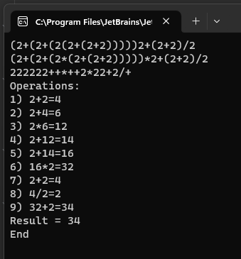

# Calculator

Простой консольный калькулятор для арифметических выражений с приоритетом операций и скобками. Парсер преобразует инфиксное выражение в обратную польскую запись и вычисляет на стеке.



## Возможности

- Операторы: `+`, `-`, `*`, `/`
- Скобки `(` `)` с любой вложенностью
- Подразумеваемое умножение: `2(2+2)` = `2*(2+2)`, `(2+2)2` = `(2+2)*2`
- Десятичные дроби: `0.1+0.2` точно равно `0.3` (используется `decimal`)
- Понятные ошибки: незакрытая скобка, двойной оператор, деление на ноль и т.д.

## Сборка

Требуется .NET 8 SDK.

```bash
cd Source
dotnet build -c Release
```

## Запуск

```bash
dotnet Source/Calculator/bin/Release/net8.0/Calculator.dll "2+2*2"
# Result = 6
```

Или через `.bat`-обёртки в корне репозитория:

```
Start 2+2.bat
Start (2+(2+(2(2+(2+2)))))2+(2+2) div 2.bat
```

## Тесты

```bash
cd Source
dotnet test
```

## Архитектура

| Компонент | Назначение |
|----|----|
| `Parser` | Лексер + проверки (баланс скобок, лидирующий/трейлинг оператор, пустые скобки, двойные операторы) |
| `Expression.Normalize` | Вставляет неявный `*` между значением и скобкой |
| `Expression.ToReversePolishNotation` | Shunting-yard преобразование в RPN |
| `CalculatorEngine.CalcExpression` | Стековый вычислитель RPN с детекцией деления на ноль |
| `IErrors` | Сбор сообщений об ошибках вместо exception-flow |
